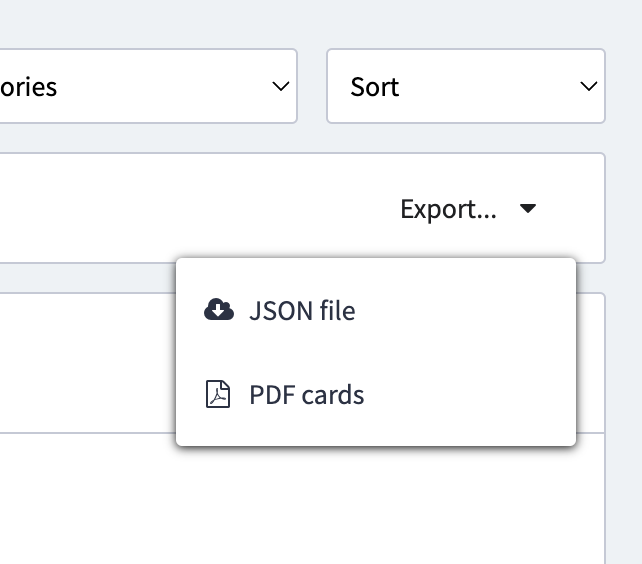

# CHOC

ConferenceHall Organization Companion

This tool takes your export.json and display a table into your terminal with the talks, speakers, ratings, ...

## Installation

### On MacOS

Requirement: install xcode-select

```
xcode-select --install
```

Then install the main package

```
brew install gouz/tools/choc
```

### Other

In release, you can find a .deb or a ubuntu gzipped file.

## Usage

Export a json of your proposal:



```sh
choc -v

Usage: choc [options] <json>

ConferenceHall organization companion

Arguments:
  json                     the json export file from Conference Hall

Options:
  -v, --version          output the version number
  -c, --with-categories  view categories (default: false)
  -f, --with-formats     view formats (default: false)
  -e, --with-companies   view speakers company (default: false)
  -a, --with-addresses   view speakers address (default: false)
  -t, --with-languages   view talks language (default: false)
  -l, --links <eventId>  view links
  -p, --compact          compact render (default: false)
  -x, --export <tsv>     export to a tsv file
  -h, --help             display help for command
```

### Web mode

**choc** is built with a webserver inside to transform you json into a nice webpage with filters.

```
choc export.json
```

You can add links to the talks with the `-w, --links`.

You need to write your event id, present in the URL in conference-hall.io .

```
choc export.json -rl 688i5iout
```

### Organizer most popular command

```
choc export.json -flecarpl 688i5iout
```

or (without links)

```
choc export.json -flecarp
```
